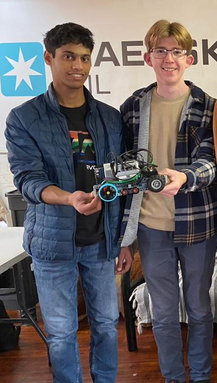

# Future Engineers 2025

Welcome to T.M.F.E.'s github for our 2025 robot

## A photo of the team with their robot:



---

## 👥 Team Information

- **Team Name:** T.M.F.E (Trust Me I'm a Future Engineer)
- **Team Members:** Raaid, Josua, HueBert the robot

---


## 📑 Contents

* 🚗 [**Mobility Management**](#-mobility-management)
    * 🛠️ [Chassis Design](#️-chassis-design)
    * 📷 [Camera Position](#-camera-position)
    * 🚦 [Color Sensor Position](#-color-sensor)
    * 🧭 [Gyro Sensor & Turns](#-gyro-sensor--turns)
    * 🔀 [Bypassing Obstacles](#-bypassing-obstacles)
    * ⚙️ [Motor Selection](#️-motor-selection)
* 🔋 [**Power & Sense Management**](#-power--sense-management)
    * 🔌 [Power Management](#-power-management)
    * 👀 [Sense Management](#-sense-management)
* 🚧 [**Obstacle Management**](#-obstacle-management)
    * 👁 [Detection Method](#-detection-method)
    * 🎯 [Steering Control](#-steering-control)
    * 🅿️ [Parking](#🅿️-parking)
* 📸 [**Pictures**](#-pictures)
    * 🤖 [Robot Photos](#-robot-photos)
    * 👥 [Team Photos](#-team-photos)
* 🎥 [**Performance Videos**](#-performance-videos)
* 📝 [**Conclusion**](#-conclusion)
    * ⚠️ [Limitations](#️-limitations)
    * 💡 [Suggestions for Further Development](#-suggestions-for-further-development)

---

## 🚗 [Mobility Management](#-contents)

### 🛠️ [Chassis Design](#-contents)


- **Materials / Kits Used:**
Our robot design consist mostly of original LEGO parts from the EV3 set, in addition to an external Raspberry Pi Pico microcontroller and other electronic sensors. The build instructions including the bill of materials for the LEGO part of the build can be found [here](other/Huebert_Build_Instructions_v1.pdf).
We used LEGO for the construction of the chassis, because it is really easy to build with and modify. For non LEGO parts like the microcontroller circuit and color sensor, we designed and 3D printed LEGO-compatible mounts using black ABS filament to integrate with the robot chassis. The models of these mounts can be found [here](models).
    
- **Design Approach:**
    
    From prior experience, we wanted to have a small and highly maneuverable robot. We started off by listing some requirements. This included minimizing the wheelbase and track width, making the chassis compact and having sharp turning.
    
- **Wheels:** 
    
    We decided on using medium sized wheels,  having wider back wheels for better grip while driving, and thinner wheels to reduce contact area while maintaining friction.

- **Weight Distribution:**
    
    Most of the weight is centered between the front and rear wheels to maintain reliable contact with the mat at any point.
    
- **Component Placement**

    We mounted the raspberry pi on a protoboard and made a 3D printed LEGO compatible mount for it
    
- **Steering Geometry:**
    
    Originally we opted for a standard parallel linkage steering mechanism, but when turning sharply found that the front wheels were slipping. We then modified the steering geometry to closely resemble ackermann steering.
- **Drivetrain:**
    
    The robot is driven using a LEGO medium motor connected to a differential gearbox system. The resulting gear ratio is 1.4:1.

### 📷 [Camera Position](#-contents)
We used a pixy cam v2 that does obstacle detection for us. 

- **Height & Angle:**
    
    We opted to position the camera on the front of the robot. It was mostly for our convenience in mounting it on the robot where there was space, but we later found it to make our lives more difficult in coding. A future improvement would be to take the angle and position of the camera into account to optimize usage of that glorious 80 degree field of view.
    
### 🚦 [Color Sensor Position](#-contents)
We used a TCS34725 color sensor board for detecting colors on the mat.

- **Positioning:**
    The position of the color sensor was carefully determined to maximize the accuracy of the detected colors. To achieve this we placed the color sensor at a specific height above the mat and centered it in the middle of the steering mechanism by designing a custom LEGO compatible mount. This resulted in accurate readings  

### 🧭 [Gyro Sensor Position](#-contents) Componente positions


### 🔀 [Bypassing Obstacles](#-contents)
The EV3 polls to pixy cam to see what objects it has tracked. We then use the largest signature(if any obstacles are tracked) and we used the x position of this tracked on object on the screen with PID controller to keep this object in front of the robot.

Once the area of the detected block reaches a certain threshold, we then started dodging the obstacle.

```python
    if block["w"] * block["h"] > BLOCK_AREA_THRESH:
      state = "OVERTAKE-RIGHT" if block["type"] == 1 else "OVERTAKE-LEFT"
      motor_angle_target = drive_motor.angle() + distance_to_angle(220)
      last_obstacle = block["type"]

      if state.endswith("RIGHT"):
        gyro_pid.target = (gyro_pid.target if delta_angle < 0 else angle) -45
      else:
        gyro_pid.target = (gyro_pid.target if delta_angle > 0 else angle) +45
```

We use the gyro controller to drive in a direction, using the gyro PID controller, to dodge the traffic object. After we have dodged the object, we use the gyro to drive forwards again and try and track the next obstacle.


### ⚙️ [Motor Selection](#-contents)

- **Motor Types:**
    
    We decided on using the LEGO medium motors for both driving and steering.
- **Reason for Choice:**
    
    The LEGO medium motors are already a part of the LEGO brick system and work well with the EV3 controller. They provide a sufficient amount of torque for driving and steering the robot. They also consume less power than the large motors, which significantly increases battery life. They also have a faster speed than the large motors which is beneficial for us since our differential gearbox significantly reduces our speed.
---

## 🔋 [Power & Sense Management](#-contents)

### 🔌 [Power Management](#-contents)
To power our robot, we use a LEGO Li-on battery pack that powers the EV3. All of the LEGO sensors and motors receive power via the ports of the EV3. The Raspberry Pi Pico, is also connected to the EV3 via one of its ports. This port provides power to the Pico. All of the devices connected to the input ports receive +5V while the motors receive up to +9V.

#### **Power Diagram of EV3**


The pico then has it's own regulated 3.3V output that it supply's to the IMU and color sensor. (Wiring diagram for pico and sensors)

- **Core Controller:**
    
    LEGO EV3
- **Secondary Controller:**
    
    Raspberry Pi Pico
- **Battery Type:**
    
    LEGO 2200mAh 7.4V Li-ion battery pack
- **Energy Distribution:**
    
    We use a combination of LEGO cables and custom cables with RJ12 ports to integrate the pi and other sensors with the EV3 brick.
- **Monitoring Features:**
    
    The EV3 screen displays the current battery voltage so we know when it needs to be replaced and recharged.
### 👀 [Sense Management](#-contents)

- **Sensors Used:**
    |Sensor (click for buy link)|Quantity Used|What it looks like|
    |:---|:---:|:---:|
    [LEGO mindstorms ultrasonic sensor](https://www.bricklink.com/v2/catalog/catalogitem.page?S=45504-1#T=S&O={%22iconly%22:0}) | 2 |
    [TCS34725 color sensor](https://www.robotics.org.za/AF1334?search=TCS34725)              | 1 |
    [Pixycam 2.1](https://tribotix.com/product/pixycam2-1/)                        | 1 |
    [MPU 6050 inertial measurement unit](https://www.robotics.org.za/GY-521) | 1 |
    [Built-in rotary encoders of the LEGO medium motors](https://www.bricklink.com/v2/catalog/catalogitem.page?S=45503-1#T=S&O={%22iconly%22:0})|2|
- **Purpose of Each Sensor:**
    - The **ultrasonic sensors** are used to recenter the robot within each straight section on the mat. We have found that the lego ultrasonic sensors' distance values lag behind reality. This means we can't rely on them to detect when to turn for example(by checking for when the inside wall disappears). In future we will probably switch to using time of flight sensors or even a scanning LIDAR.
    
    - The **color sensor** is used to detect the colored lines on the mat to decide when to turn. Initially we used a HiTechnic color sensor however it was quickly found to inadequate. It could not detect the colors in the short amount of time when driving over a line.

        The TCS34725 sensor returns color in the form of RGB. In order to detect orange and blue lines, we convert this color to HSV(Hue, Saturation, Value) and then simply check for a range of values for H, S and V.

        The following algorithm is used to convert RGB to HSV:

        ```C
        // Find min and max component
        float max = r;
        if (g > max) max = g;
        if (b > max) max = b;

        float min = r;
        if (g < min) min = g;
        if (b < min) min = b;

        // Calculate difference between min and max channel
        float delta = max - min;

        float h = 0.0f;
        float s = 0.0f;
        float v = max;
    
        // Determine values for saturation and hue
        if (delta > 0.00001f) {
            s = (max > 0.0f) ? (delta / max) : 0.0f;

            if (max == r) {
                h = 60.0f * ((g - b) / delta);
                if (h < 0.0f) h += 360.0f;
            } else if (max == g) {
                h = 60.0f * (((b - r) / delta) + 2.0f);
            } else {
                h = 60.0f * (((r - g) / delta) + 4.0f);
            }
        }
        ```
        
        Then we check for orange and blue using the following:
        ```C
        // Check thresholds for blue and orange colors
        if (s > 0.35f && v > 0.6f) {
            // Blue range
            if (h >= 200.0f && h <= 250.0f) {   // Hue range for blue
                return COLOR_BLUE;
            }
        } else if (s > 0.45f && v > 0.7f) {
            if ((h >= 0.0f && h <= 50.0f) || (h >= 340.0f && h <= 360.0f)) {    // Hue range for orange
                return COLOR_ORANGE;
            }
        }
        ```
        
        We did however find that the color sensor is more sensitive to red than it is to blue. So we also needed to do color correction. This is done by first using a white reference(e.g. a piece of paper) and seeing what the raw color values from the sensor is. We then use this raw color to apply a correction using the following algorithm:

        ```python
      def get_color_corrected(self):
            raw = self.get_color() # Raw color

            # Divide each channel by the corresponding channel in our white reference
            col = [raw[i]/self.white[i] for i in range(3)]

            # Find the maximum component of our color and normalize each channel in range 0..1
            max_component = max(col[0], max(col[1], col[2]))
            norm = [c/max_component for c in col]

            return norm
        
        ```
    
    - The **pixy cam** is used to detect traffic objects in the obstacle challenge. Using the pixy removed the need for us to do the computer vision ourselves. The pixy also provides a convenient interface over I2C to get the objects that it is tracking. We simply configure the camera on a pc via PixyMon to get it to track red and green traffic lights.

        We get the largest block from the pixy cam using the following function:
        ```python
         # Function that returns the largest detected object
         def get_largest_signiture(self):
            # Send command bytes to get the largest block
            cmd = bytes((174, 193, 32, 2, 255, 1))
            self.write(0, cmd)

            # Read in the response packet
            response = self.read(0, 20)

            # Return a dictionary containing the information about the currently detected block.
            return {
              "type":int.from_bytes(response[6:8], 'little'),
              "cx":int.from_bytes(response[8:10], 'little'),
              "cy":int.from_bytes(response[10:12], 'little'),
              "w":int.from_bytes(response[12:14], 'little'),
              "h":int.from_bytes(response[14:16], 'little'),
            }
        ```
        
        We send a command over I2C and receive data from the pixy. The data from the pixy is 5 unsigned shorts in little endian format which we decode according to the pixy documentation.

        During testing, we found that the pixy cam is quite unreliable in varying light conditions. During our research, we found that using [OpenCV](https://opencv.org/) to detect obstacles was far more reliable than the pixy. We believe a future improvement will be to use opencv on a Raspberry Pi.
    
    - The IMU is used to track the robot's absolute angle during the run. We use this sensor to drive in a straight line, make turns around corners and overtake objects.

        Initially one of LEGO's gyro sensors however there it would continuously drift over time. This meant it was highly unreliable. Another issue was that the gyro did not have high angular resolution.
        
        We also considered a HiTechnic compass sensor and this would have fixed our issues. However for a certain range of angles, the compass sensor did not return the correct absolute angle. So this was also quite unreliable.
        
        In the end, we opted for the MPU6050 IMU as it has a much higher angular resolution as well as a high data rate(8000 Hz). The MPU measures angular velocity so inorder to get angular position we numerically integrate the data. We also pass the raw angular velocity through a low pass filter to get rid of noise above ~600 Hz in our data. We use the following code:
        
        ```C
        float buf[7];
        mpu6050_read_float(buf);    // Get data from mpu

        // Calculate delta time between loop iterations
        current_time = to_us_since_boot(get_absolute_time());
        float delta_time = (float)(current_time - last_time)/1000000;
        last_time = current_time;
        
        // Apply a low pass filter
        float alpha = delta_time / (RC + delta_time);
        gyro_prev = alpha * buf[6] + (1-alpha) * gyro_prev;
        angle += delta_time * gyro_prev;
        ```
        The following photos show's the gyro data before and after applying a lowpass filter:
        
        
        
        
    
    
    - The motor's rotary encoders are used to drive specific distances based on rotations of the drive motor as well as turn the steering to specific angles. This is done by dividing the distance we want to travel by the circumference of our wheels to get the number of rotations. We then multiply by the gears ratio and multiply by 360 to get degrees:
        ```python
        def distance_to_angle(dist_mm: int):
          wheel_diameter = 56   # Wheel has 56 mm diameter
          PI = 3.1415926535   # PI
          gear_ratio = 1.4    # Gear ratio of our drive motor to wheels is 1.4:1
          return int(dist_mm / (wheel_diameter * PI) * gear_ratio * 360)
        ```

- **Circuitry:**
    
    The Pixy cam as well as the ultrasonic sensors are connected directly to the EV3 brick via its sensor input ports. The EV3 receives information about detected lines and absolute angle via the Raspberry Pi Pico which is connected on another input port.
    
    #### Wiring diagram of EV3 brick and sensors
    
    

    The Raspberry Pi Pico handles detected colored lines and integrating angular velocity to get absolute angle. The following wiring diagram shows
    how the pico and its sensors receive power
    
    #### Wiring diagram of Raspberry Pi Pico and sensors
    

---

## 🚧 [Obstacle Management](#-contents)

To tackle the obstacle challenge, we first identified a few key scenarios that the robot might encounter during a run. These are: cruising in a straight line at the center of a lane, tracking an object and driving towards it, overtaking an object and finally turning around corners.

We abstracted this way in code by using a state machine architecture. The state machine is in one large while loop. Our obstacle challnge program follow the following procedure:


Our main states are `CRUISE, TRACK_OBJECT, OVERTAKE and LTURN`. 

We first start by initialing our sensors and motors on their corresponding ports. The gyro is also calibrated by the Pi Pico. It collects 10000 raw gyro samples and averages this to calculate the bias of each gyro axis. We then are in a wait state which continously loops until the center button is pressed. 

Then we transition to `CRUISE` state and enter our main program loop.. At the beginning each loop iteration we get data from our sensors and calculate:

```python
angle = gyro.get_angle()
delta_angle = angle - prev_angle
prev_angle = angle

right_dist = right_us.distance()
left_dist = left_us.distance()
lane_width = right_dist + left_dist
dist =  right_dist - left_dist
delta_dist = abs(dist)
```


### 👁 [Detection Method](#-contents)
- **Camera / Sensor Used:**
    
    We use the built-in object detection running on the pixycam for detecting obstacles and getting their sizes and positions on screen. We then track the center of these objects and by calculating the area of these objects on screen we determine if we are close enough to need to enter the dodging maneuver.

### 🎯 [Steering Control](#-contents)
When no obstacles are detected, 2 PID controllers are used in tandem to drive in a straight line using the gyro and ultarsonic sensors. For the open challenge, the ultrasonics are used to keep the robot in the center of a lane while the gyro is used as a fallback when the delta angle w.r.t the walls is greater than 30º.(We found the ultrasonic sensors to behave inconsistently beyond those angles)

- **PID/PD Settings:**
    
    In the beginning, extensive time was poured into logging data and tuning our PID controllers.(Fill in more info later? Possibly use graphs)

### 🅿️ [Parking](#-contents)
- **Parking Steps:**

    The robot exits and enters the parking bay by using a fixed parking routine. It starts the obstacle challenge run by exiting the parking bay and ends it by parking the robot parallel to the wall.
- **Parking Detection:**

    After the robot has completed its final lap it starts following the outer wall at a close distance using the outer ultrasonic sensor, keeping straight with the assistance of the gyro sensor. It then looks for two large jumps in the measured distance before entering the parking maneuver. 


---

## 📸 [Pictures](#-contents)

### 🤖 [Robot Photos](#-contents)
Here are pictures of our robot, HueBert:

**Top View:**


**Front View:**


**Right Side View:**


**Left Side View:**


**Rear View:**


**Bottom View:**


### 👥 [Team Photos](#-contents)

*(Insert images or links)*

---

## 🎥 [Performance Videos](#-contents)

- **Open Challenge:**
    
    [](https://www.youtube.com/watch?v=4Hjj77qfgQk "Click to open with YouTube")
- **Obstacle Challenge:**

---

## 📝 [Conclusion](#-contents)

### ⚠️ [Limitations](#-contents)

- **Mobility:**
- **Power & Sense:**
- **Obstacle Management:**

### 💡 [Suggestions for Further Development](#-contents)

- **Hardware Upgrades:**
- **Software Improvements:**
- **Sensor Enhancements:**
