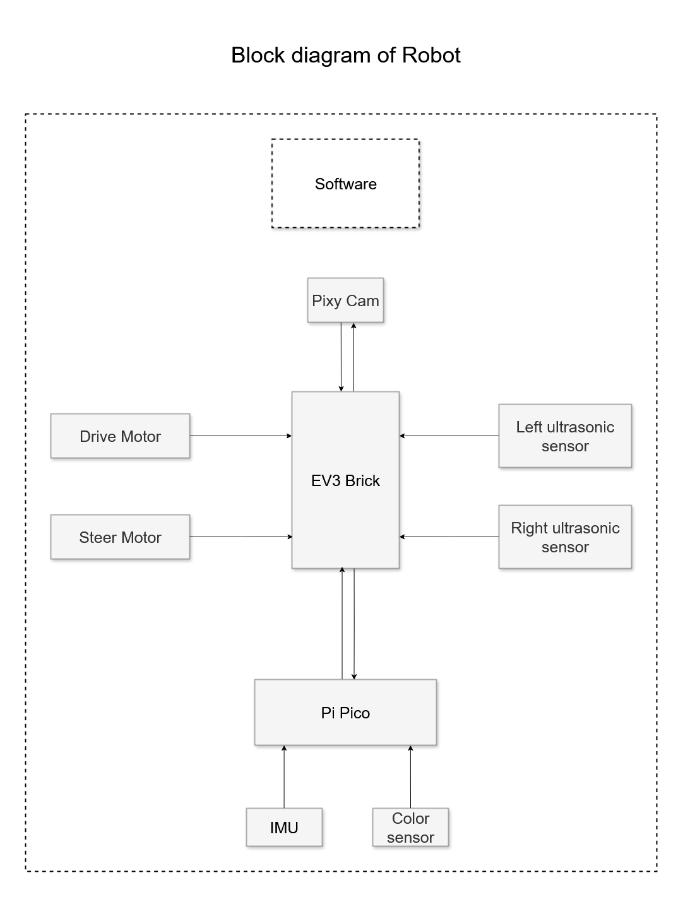
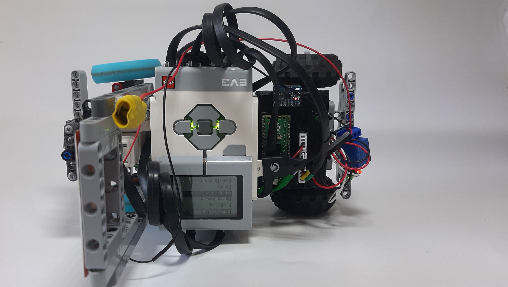
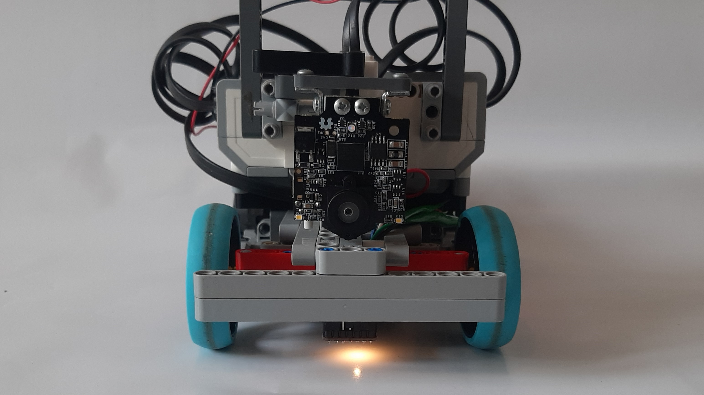
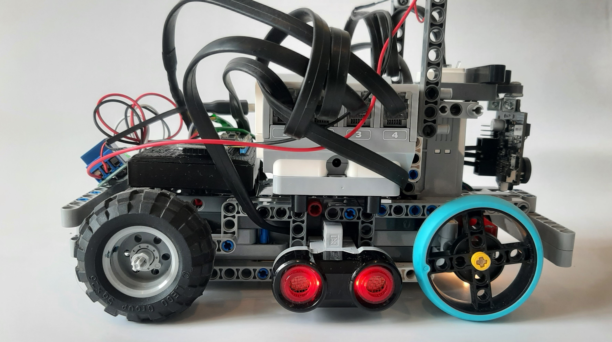
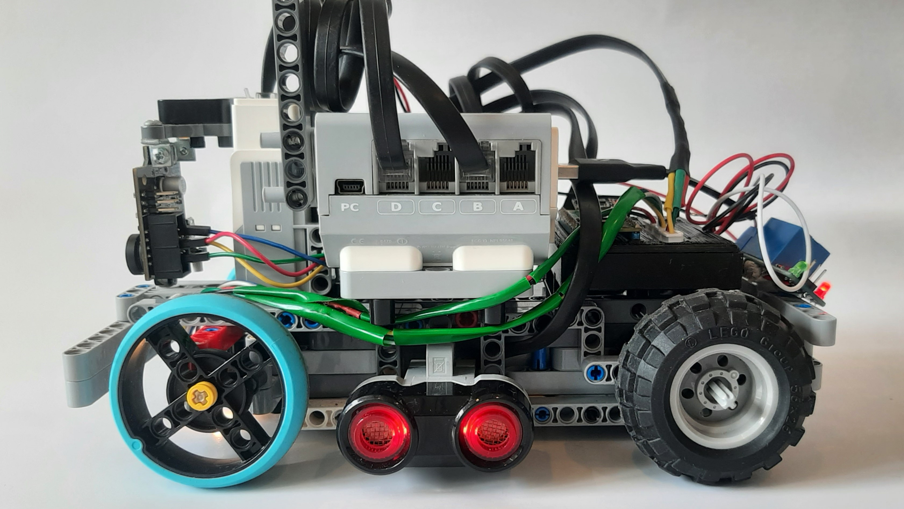
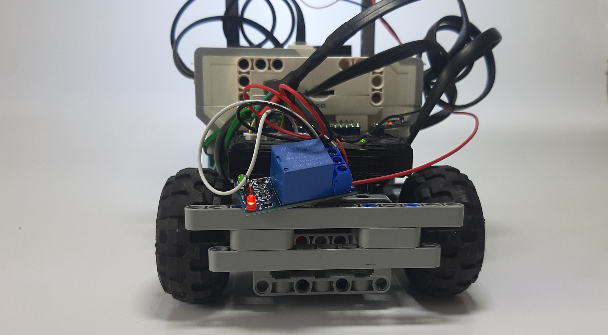
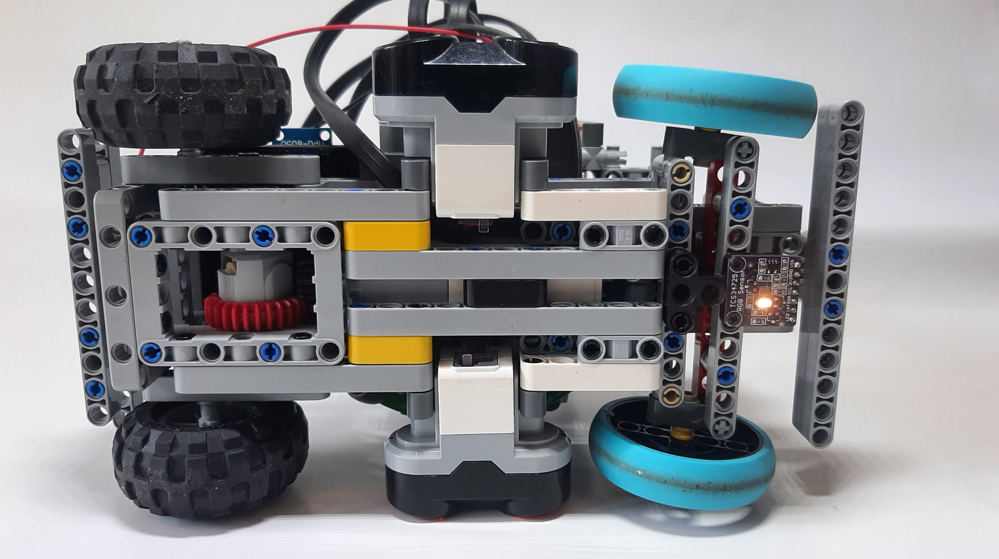

# Future Engineers 2025

---

## 👥 Team Information

- **Team Name:** T.M.F.E (Trust Me I'm a Future Engineer)
- **Team Members:** Raaid, Josua, Rayhan
- **Email:**
- **Logo / Images:**

---

## 🏆 Achievements

- **Previous Competitions & Results:**

---

## 📑 Contents

* 🚗 [**Mobility Management**](#-mobility-management)
    * 🛠️ [Chassis Design](#️-chassis-design)
    * 📷 [Camera Position](#-camera-position)
    * 🧭 [Gyro Sensor & Turns](#-gyro-sensor--turns)
    * 🎯 [Steering Control](#-steering-control)
    * 🔀 [Bypassing Obstacles](#-bypassing-obstacles)
    * ⚙️ [Motor Selection](#️-motor-selection)
* 🔋 [**Power & Sense Management**](#-power--sense-management)
    * 🔌 [Power Management](#-power-management)
    * 👀 [Sense Management](#-sense-management)
* 🚧 [**Obstacle Management**](#-obstacle-management)
    * 🎯 [Detection Method](#-detection-method)
    * 🤖 [Automatic Control](#-automatic-control)
    * 🅿️ [Parking](#🅿️-parking)
* 📸 [**Pictures**](#-pictures)
    * 🤖 [Robot Photos](#-robot-photos)
    * 👥 [Team Photos](#-team-photos)
* 🎥 [**Performance Videos**](#-performance-videos)
* 💻 [**Code Explanation**](#-code-explanation)
* 📝 [**Conclusion**](#-conclusion)
    * ⚠️ [Limitations](#️-limitations)
    * 💡 [Suggestions for Further Development](#-suggestions-for-further-development)

---

## 🚗 [Mobility Management](#-contents)

### 🛠️ [Chassis Design](#-contents)

Our robot design consist mostly of original LEGO parts from the EV3 set, in addition to an external Raspberry Pi Pico microcontroller and other electronic sensors. The build instructions for the lego part of the build can be found [here]([other/Huebert%20v1%20Build%20Instructions.pdf](https://github.com/butterYeeter/future-engineers-2025/blob/master/other/Huebert%20v1%20Build%20Instructions.pdf))

- **Design Approach:**
    From prior experience, we wanted to have a small and highly manouverable robot. We started off by listing some requirements. This included minizmizing the wheelbase and trackwidth, making the chasis compact and having sharp turning.
    
- **Steering Geometry:**
    Originally we opted for a standard parallel linkage steering mechanism, but when turning sharply found that the front wheels were slipping. We then modified the steering geometry to closely resemble ackermann steering.
- **Materials / Kits Used:**
    We used LEGO for the construction of the chassis, since it's really easy to work with and easy to modify. For non LEGO parts like the microcontroller and color sensor, we designed and 3D printed mounts in ABS to integrate with the robot chassis.

### 📷 [Camera Position](#-contents)
We used a pixy cam v2 that does obstacle detection for us. 

- **Height & Angle:**
    The position we opted for was mostly for our convenience in mounting it on the robot where there was space, but we later found it to make our lives more difficult in coding. A future improvement would be to take the angle and position of the camera into account to optimize usage of that glorious 80 degree field of view.
    
- **Reasoning:**
    Using the pixy removed the need for us to do the computer vision for tracking obstacles our selves. The pixy also provides a convenient interface over I2C to get the objects that it has tracked. We simply configure the camera on a pc to get it to track red and green traffic lights.

### 🧭 [Gyro Sensor & Turns](#-contents)
The gyro proved to be and incredibly important sensor for our robot. Initially one of the EV3 gyro sensors was used. However we quickly ran into issues. One issue was that it highly unreliable. The LEGO gyro tends to drift overtime. Another issue was that the gyro didn't have a high angular resolution.

- **Sensor Used:**
    To fix this, we used an MPU6050 IMU with our raspberry pi. The MPU6050 has a much higher angular resolution and polling rate. The raspberry pi polls the MPU as fast as possible(the maximum rate is 8000 Hz). 

- **Control Algorithm:**
    The MPU returns angular velocity which we then integrate numerically to get absolute. We also pass the raw gyro data through a dynamic low pass filter which filters out noise above ~600 Hz. The absolute angle is passed to a PID controller on the EV3.

### 🎯 [Steering Control](#-contents)
When no obstacles are detected, 2 PID controllers are used in tandem to drive in a straight line using the gyro and ultarsonic sensors. For the open challenge, the ultrasonics are used to keep the robot in the center of a lane while the gyro is used as a fallback when the delta angle w.r.t the walls is greater than 30º.(We found the ultrasonic sensors to behave inconsistently beyond those angles)

- **PID/PD Settings:**
    In the beginning, extensive time was poured into logging data and tuning our PID controllers.(Fill in more info later? Possibly use graphs)


### 🔀 [Bypassing Obstacles](#-contents)
The EV3 polls to pixy cam to see what objects it has tracked. We then use the largest signiture(if any obstacales are tracked) and we used the x position of this tracked on object on the screen with PID controller to keep this object in front of the robot.

Once the area of the detected block reaches a certain threshold, we then started dodging the obstacle.

```python
    if block["w"] * block["h"] > BLOCK_AREA_THRESH:
      state = "OVERTAKE-RIGHT" if block["type"] == 1 else "OVERTAKE-LEFT"
      motor_angle_target = drive_motor.angle() + distance_to_angle(220)
      last_obstacle = block["type"]

      if state.endswith("RIGHT"):
        gyro_pid.target = (gyro_pid.target if delta_angle < 0 else angle) -45
      else:
        gyro_pid.target = (gyro_pid.target if delta_angle > 0 else angle) +45
```

We use the gyro controller to drive in a direction, using the gyro PID controller, to dodge the traffic object. After we have dodged the object, we use the gyro to drive forwards again and try and track the next obstacle.


### ⚙️ [Motor Selection](#-contents)

- **Motor Types:**
    We decided on using the LEGO medium motors for both driving and steering.
- **Reason for Choice:**
    The LEGO medium motors are already a part of the LEGO brick system and work well with the EV3 controller. They provide a sufficient amount of torque for driving and steering the robot. They also consume less power than the large motors, which significantly inceases battery life.
---

## 🔋 [Power & Sense Management](#-contents)

### 🔌 [Power Management](#-contents)
To power our robot, we use a LEGO Li-on battery pack that powers the EV3. All of the LEGO sensors and motors receive power via the ports of the EV3. The raspberry pi, is also connected to the EV3 via one of its ports. This port provides power to the pico.(Wiring diagram of ev3)

The pico then has it's own regulated 3.3V output that it supply's to the IMU and color sensor. (Wiring diagram for pico and sensors)

- **Core Controller:**
    LEGO EV3
- **Battery Type:**
    LEGO 2050mAh 7.4V Li-ion battery pack
- **Energy Distribution:**
    We use a combination of LEGO cables and custom cables with RJ12 ports to integrate with the EV3 brick.
- **Monitoring Features:**
    The EV3 screen displays the current battery voltage so we know when it needs to be replaced and recharged.
### 👀 [Sense Management](#-contents)

- **Sensors Used(click for buy link):**
    |Sensor|Quantity|Image|
    |:---|:---:|:---:|
    [LEGO mindstorms ultrasonic sensor](https://www.bricklink.com/v2/catalog/catalogitem.page?S=45504-1#T=S&O={%22iconly%22:0}) | 2 |
    [TCS34725 color sensor](https://www.robotics.org.za/AF1334?search=TCS34725)              | 1 |
    [Pixycam 2.1](https://tribotix.com/product/pixycam2-1/)                        | 1 |
    [MPU 6050 inertial measurement unit](https://www.robotics.org.za/GY-521) | 1 |
    [Built-in rotary encoders of the LEGO medium motors](https://www.bricklink.com/v2/catalog/catalogitem.page?S=45503-1#T=S&O={%22iconly%22:0})|2|
- **Purpose of Each Sensor:**
    The ultrasonics are used to recenter the robot within each straight section on the mat
    
    The color sensor is used to detect the colored lines on the mat to decide when to turn
    
    A pixy cam is used to detect traffic objects in the obstacle challenge
    
    The IMU is used to track the robot's absolute angle during the run
    
    The motor's rotary encoders are used to drive specific distances based on rotations of the drive motor as well as turn the steering to specidfic angles

- **Circuitry**
    The Pixy cam as well as the ultrasonic sensors are connected directly to the EV3 brick via its sensor input ports. The EV3 receives information about detected lines and absolute angle via the Rapberry Pi Pico which is connected on another input port.
    
    ### Wiring diagram of EV3 brick and sensors
    
    

    The Raspberry Pi Pico handles detected colored lines and integrating angular velocity to get absolute angle. The following wiring diagram shows
    how the pico and its sensors receive power
    
    ### Wiring diagram of Rapberry Pi Pico and sensors
    

---

## 🚧 [Obstacle Management](#-contents)

### 🎯 [Detection Method](#-contents)

- **Camera / Sensor Used:**
- **Coordinate Processing:**


### 🅿️ [Parking](#-contents)
(TBD)
- **Parking Detection:**
- **Parking Steps:**

---

## 📸 [Pictures](#-contents)

### 🤖 [Robot Photos](#-contents)
Here are pictures of our robot, HueBert:

**Top View:**


**Front View**


**Rigth Side View**


**Left Side View**


**Rear View**


**Bottom View**



### 👥 [Team Photos](#-contents)

*(Insert images or links)*

---

## 🎥 [Performance Videos](#-contents)

- **Open Challenge:**
- **Obstacle Challenge:**
- **Parts Discussion:**

---

## 💻 [Code Explanation](#-contents)

- **Programming Language / Platform:**
- **Main Logic Flow:**
- **Parallel Processes / Threads:**

`Code is Cool`

---

## 📝 [Conclusion](#-contents)

### ⚠️ [Limitations](#-contents)

- **Mobility:**
- **Power & Sense:**
- **Obstacle Management:**

### 💡 [Suggestions for Further Development](#-contents)

- **Hardware Upgrades:**
- **Software Improvements:**
- **Sensor Enhancements:**
