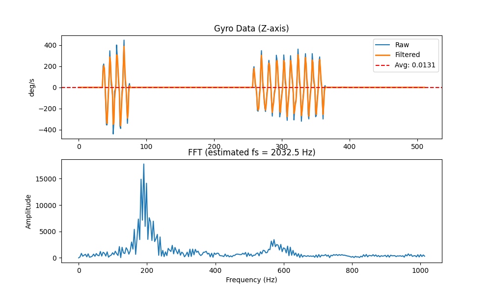

# Future Engineers 2025

Welcome to T.M.F.E.'s github for 2025

## A photo of the team with their robot:


---

## 👥 Team Information

- **Team Name:** T.M.F.E (Trust Me I'm a Future Engineer)
- **Team Members:** Raaid, Josua, HueBert the robot

---


## 📑 Contents

* 🚗 [**Mobility Management**](#-mobility-management)
    * 🛠️ [Chassis Design](#️-chassis-design)
    * 📷 [Camera Position](#-camera-position)
    * 🚦 [Color Sensor Position](#-color-sensor-position)
    * 🧭 [Gyro Sensor Position](#-gyro-sensor-position)
    * ⚙️ [Motor Selection](#️-motor-selection)
* 🔋 [**Power & Sense Management**](#-power--sense-management)
    * 🔌 [Power Management](#-power-management)
    * 👀 [Sense Management](#-sense-management)
* 🚧 [**Obstacle Management**](#-obstacle-management)
    * 🖲️ [Sensor Polling](#-sensor-polling)
    * 🎯 [Steering Control](#-steering-control)
    * 👁 [Detection Method](#-detection-method)
    * 🔀 [Bypassing Obstacles](#-bypassing-obstacles)
    * 🧱 ["L"-shaped turn](#-l-shaped-turn)
    * 🅿️ [Parking](#🅿️-parking)
* 📸 [**Pictures**](#-pictures)
    * 🤖 [Robot Photos](#-robot-photos)
    * 👥 [Team Photos](#-team-photos)
* 🎥 [**Performance Videos**](#-performance-videos)
* 📝 [**Evaluation for Future Development**](#-evaluation-for-future-development)
    * 🤖 [Hardware Evaluation](#-hardware-evaluation)
    * 💾 [Software Evaluation](#-software-evaluation)
* ☎ [**Contact Us**](#-contact-us)
---

## 🚗 [Mobility Management](#-contents)

### 🛠️ [Chassis Design](#-contents)


- **Materials / Kits Used:**
    
    Our robot design consist mostly of original LEGO parts from the EV3 set, in addition to an external Raspberry Pi Pico microcontroller and other electronic sensors. The build instructions including the bill of materials for the LEGO part of the build can be found [here](other/Huebert_Build_Instructions_v1.pdf).
    
    We used LEGO for the construction of the chassis, because it is really easy to build with and modify. For non LEGO parts like the microcontroller circuit and color sensor, we designed and 3D printed LEGO-compatible mounts using black ABS filament to integrate with the robot chassis. The models of these mounts can be found [here](models).
    
- **Design Approach:**
    
    From prior experience, we wanted to have a small and highly maneuverable robot. We started off by listing some requirements. This included minimizing the wheelbase and track width, making the chassis compact and having sharp turning.
    
- **Wheels:** 
    
    We decided on using medium sized wheels,  having wider back wheels for better grip while driving, and thinner wheels to reduce contact area while maintaining friction.

- **Weight Distribution:**
    
    Most of the weight is centered between the front and rear wheels to maintain reliable contact with the mat at any point.
    
- **Component Placement**

    We mounted the raspberry pi on a protoboard and made a 3D printed LEGO compatible mount for it. The mount was designed to fit the robot and not the other way around. We added ports on the protoboard with wires that connect to the various components.
    
- **Steering Geometry:**
    
    Originally we opted for a standard parallel linkage steering mechanism, but when turning sharply found that the front wheels were slipping. We then modified the steering geometry to closely resemble ackermann steering.
    
- **Drivetrain:**
    
    The robot is driven using a LEGO medium motor connected to a differential gearbox system. The resulting gear ratio is 1.4:1.

### 📷 [Camera Position](#-contents)
We used a pixy cam v2 that does obstacle detection for us. 

- **Height & Angle:**
    
    We opted to position the camera on the front of the robot. It was mostly for our convenience in mounting it on the robot where there was space, but we later found it to make our lives more difficult in coding. A future improvement would be to take the angle and position of the camera into account to optimize usage of that glorious 80 degree field of view.
    
### 🚦 [Color Sensor Position](#-contents)
- We used a TCS34725 color sensor board for detecting colors on the mat. The position of the color sensor was carefully determined to maximize the accuracy of the detected colors. To achieve this we placed the color sensor at a specific height above the mat and centered it in the middle of the steering mechanism by designing a custom LEGO compatible mount. This resulted in accurate readings 

### 🧭 [Gyro Sensor Position](#-contents)
- We used an MPU6050 inertial measurement unit as our gyro sensor. The gyro sensor was mounted on a protoboard near the raspberry pi pico to make the wiring easy. We also found that placing the sensor near the center of the robot wasn't necessary due to the size of the robot. 


### ⚙️ [Motor Selection](#-contents)

- **Motor Types:**
    
    We decided on using the LEGO medium motors for both driving and steering.
- **Reason for Choice:**
    
    The LEGO medium motors are already a part of the LEGO brick system and work well with the EV3 controller. They provide a sufficient amount of torque for driving and steering the robot. They also consume less power than the large motors, which significantly increases battery life. They also have a faster speed than the large motors which is beneficial for us since our differential gearbox significantly reduces our speed.
---

## 🔋 [Power & Sense Management](#-contents)

### 🔌 [Power Management](#-contents)
To power our robot, we use a LEGO Li-on battery pack that powers the EV3. All of the LEGO sensors and motors receive power via the ports of the EV3. The Raspberry Pi Pico, is also connected to the EV3 via one of its ports. This port provides power to the Pico. All of the devices connected to the input ports receive +5V while the motors receive up to +9V.

#### **Power Diagram of EV3**


The pico then has it's own regulated 3.3V output that it supply's to the IMU and color sensor. (Wiring diagram for pico and sensors)

- **Core Controller:**
    
    LEGO EV3
- **Secondary Controller:**
    
    Raspberry Pi Pico
- **Battery Type:**
    
    LEGO 2200mAh 7.4V Li-ion battery pack
- **Energy Distribution:**
    
    We use a combination of LEGO cables and custom cables with RJ12 ports to integrate the pi and other sensors with the EV3 brick.
- **Monitoring Features:**
    
    The EV3 screen displays the current battery voltage so we know when it needs to be replaced and recharged.
### 👀 [Sense Management](#-contents)

- **Sensors Used:**
    |Sensor (click for buy link)|Quantity Used|What it looks like|
    |:---|:---:|:---:|
    [LEGO mindstorms ultrasonic sensor](https://www.bricklink.com/v2/catalog/catalogitem.page?S=45504-1#T=S&O={%22iconly%22:0}) | 2 |
    [TCS34725 color sensor](https://www.robotics.org.za/AF1334?search=TCS34725)              | 1 |
    [Pixycam 2.1](https://tribotix.com/product/pixycam2-1/)                        | 1 |
    [MPU 6050 inertial measurement unit](https://www.robotics.org.za/GY-521) | 1 |
    [Built-in rotary encoders of the LEGO medium motors](https://www.bricklink.com/v2/catalog/catalogitem.page?S=45503-1#T=S&O={%22iconly%22:0})|2|
- **Purpose of Each Sensor:**
    - The **ultrasonic sensors** are used to recenter the robot within each straight section on the mat. We have found that the LEGO ultrasonic sensors' distance values lag behind reality. This means we can't rely on them to detect when to turn for example(by checking for when the inside wall disappears). In future we will probably switch to using time of flight sensors or even a scanning LIDAR.
    
    - The **color sensor** is used to detect the colored lines on the mat to decide when to turn. Initially we used a HiTechnic color sensor however it was quickly found to inadequate. It could not detect the colors in the short amount of time when driving over a line.

        The TCS34725 sensor returns color in the form of RGB. In order to detect orange and blue lines, we convert this color to HSV(Hue, Saturation, Value) and then simply check for a range of values for H, S and V.

        The following algorithm is used to convert RGB to HSV:

        ```C
        // Find min and max component
        float max = r;
        if (g > max) max = g;
        if (b > max) max = b;

        float min = r;
        if (g < min) min = g;
        if (b < min) min = b;

        // Calculate difference between min and max channel
        float delta = max - min;

        float h = 0.0f;
        float s = 0.0f;
        float v = max;
    
        // Determine values for saturation and hue
        if (delta > 0.00001f) {
            s = (max > 0.0f) ? (delta / max) : 0.0f;

            if (max == r) {
                h = 60.0f * ((g - b) / delta);
                if (h < 0.0f) h += 360.0f;
            } else if (max == g) {
                h = 60.0f * (((b - r) / delta) + 2.0f);
            } else {
                h = 60.0f * (((r - g) / delta) + 4.0f);
            }
        }
        ```
        
        Then we check for orange and blue using the following:
        ```C!
        // Check thresholds for blue and orange colors
        if (s > 0.35f && v > 0.6f) {
            // Blue range
            if (h >= 200.0f && h <= 250.0f) {   // Hue range for blue
                return COLOR_BLUE;
            }
        } else if (s > 0.45f && v > 0.7f) {
            if ((h >= 0.0f && h <= 50.0f) || (h >= 340.0f && h <= 360.0f)) {    // Hue range for orange
                return COLOR_ORANGE;
            }
        }
        ```
        
        We did however find that the color sensor is more sensitive to red than it is to blue. So we also needed to do color correction. This is done by first using a white reference(e.g. a piece of paper) and seeing what the raw color values from the sensor is. We then use this raw color to apply a correction using the following algorithm:

        ```python!
      def get_color_corrected(self):
            raw = self.get_color() # Raw color

            # Divide each channel by the corresponding channel in our white reference
            col = [raw[i]/self.white[i] for i in range(3)]

            # Find the maximum component of our color and normalize each channel in range 0..1
            max_component = max(col[0], max(col[1], col[2]))
            norm = [c/max_component for c in col]

            return norm
        
        ```
    
    - The **pixy cam** is used to detect traffic objects in the obstacle challenge. Using the pixy removed the need for us to do the computer vision ourselves. The pixy also provides a convenient interface over I2C to get the objects that it is tracking. We simply configure the camera on a pc via PixyMon to get it to track red and green traffic lights.

        We get the largest block from the pixy cam using the following function:
        ```python !
         # Function that returns the largest detected object
         def get_largest_signature(self):
            # Send command bytes to get the largest block
            cmd = bytes((174, 193, 32, 2, 255, 1))
            self.write(0, cmd)

            # Read in the response packet
            response = self.read(0, 20)

            # Return a dictionary containing the information about the currently detected block.
            return {
              "type":int.from_bytes(response[6:8], 'little'),
              "cx":int.from_bytes(response[8:10], 'little'),
              "cy":int.from_bytes(response[10:12], 'little'),
              "w":int.from_bytes(response[12:14], 'little'),
              "h":int.from_bytes(response[14:16], 'little'),
            }
        ```
        
        We send a command over I2C and receive data from the pixy. The data from the pixy is 5 unsigned shorts in little endian format which we decode according to the pixy documentation.

        During testing, we found that the pixy cam is quite unreliable in varying light conditions. During our research, we found that using [OpenCV](https://opencv.org/) to detect obstacles was far more reliable than the pixy. We believe a future improvement will be to use opencv on a Raspberry Pi.
    
    - The IMU is used to track the robot's absolute angle during the run. We use this sensor to drive in a straight line, make turns around corners and overtake objects.

        Initially one of LEGO's gyro sensors however there it would continuously drift over time. This meant it was highly unreliable. Another issue was that the gyro did not have high angular resolution.
        
        We also considered a HiTechnic compass sensor and this would have fixed our issues. However for a certain range of angles, the compass sensor did not return the correct absolute angle. So this was also quite unreliable.
        
        In the end, we opted for the MPU6050 IMU as it has a much higher angular resolution as well as a high data rate(8000 Hz). The MPU measures angular velocity so in order to get angular position we numerically integrate the data. We also pass the raw angular velocity through a low pass filter to get rid of noise above ~600 Hz in our data. We use the following code:
        
        ```C
        float buf[7];
        mpu6050_read_float(buf);    // Get data from mpu

        // Calculate delta time between loop iterations
        current_time = to_us_since_boot(get_absolute_time());
        float delta_time = (float)(current_time - last_time)/1000000;
        last_time = current_time;
        
        // Apply a low pass filter
        float alpha = delta_time / (RC + delta_time);
        gyro_prev = alpha * buf[6] + (1-alpha) * gyro_prev;
        angle += delta_time * gyro_prev;
        ```
        The following photos show's the gyro data before and after applying a lowpass filter:
        
        
        
        
    
    
    - The motor's **rotary encoders** are used to drive specific distances based on rotations of the drive motor as well as turn the steering to specific angles. This is done by dividing the distance we want to travel by the circumference of our wheels to get the number of rotations. We then multiply by the gears ratio and multiply by 360 to get degrees:

        ```python
        def distance_to_angle(dist_mm: int):
            # Wheel has 56 mm diameter  
            wheel_diameter = 56
            # PI
            PI = 3.1415926535
            # Gear ratio of our drive motor to wheels is 1.4:1
            gear_ratio = 1.4
            # Return the calculated amount in degrees
            return int(dist_mm / (wheel_diameter * PI) * gear_ratio * 360)
        ```

- **Circuitry:**
    
    The Pixy cam as well as the ultrasonic sensors are connected directly to the EV3 brick via its sensor input ports. The EV3 receives information about detected lines and absolute angle via the Raspberry Pi Pico which is connected on another input port.
    
    #### Wiring diagram of EV3 brick and sensors
    
    

    The Raspberry Pi Pico handles detected colored lines and integrating angular velocity to get absolute angle. The following wiring diagram shows
    how the pico and its sensors receive power
    
    #### Wiring diagram of Raspberry Pi Pico and sensors
    

---

## 🚧 [Obstacle Management](#-contents)

To tackle the obstacle challenge, we first identified a few key scenarios that the robot might encounter during a run. These are: cruising in a straight line at the center of a lane, tracking an object and driving towards it, overtaking an object and finally turning around corners.

We abstracted this way in code by using a state machine architecture. The state machine is in one large while loop. Our obstacle challenge program follow the following procedure:


Our main states are `CRUISE, TRACK_OBJECT, OVERTAKE and LTURN`. 

We first start by initialing our sensors and motors on their corresponding ports. The gyro is also calibrated by the Pi Pico. It collects 10000 raw gyro samples and averages this to calculate the bias of each gyro axis. We then are in a wait state which continuously loops until the center button is pressed. 

Outside of our main loop, we store some state about the run:
```python
# Current state
state="CRUISE"
# The angle reported by the gyro at the beginning of a run
start_of_round_heading = gyro.get_angle()
# The round direction. We assume CCW by default
challenge_direction = 1
# The direction we'll be facing at the end of the run
end_of_round_heading = challenge_direction * 360 * NUM_LAPS + start_of_round_heading
# Current weight of the gyro PID controller in cruise mode
gyro_weight = GYRO_WEIGHT
# Current weight of ultrasonic PID controller in cruise  mode
us_weight = US_WEIGHT
# The current angle reported by the gyro
angle = gyro.get_angle()
# Variable used to store how many motor rotations are need to overtake an obstacle
motor_angle_target = 0
# The last obstacle we passed
last_obstacle = 0
# Variable to determine the time between detecting colored lines. Used to prevent false positives
last_turn_time = timer.time() - 1500
# The number of turns the robot has made
turns = 0

```

### 🖲️ [Sensor Polling](#-contents)

Then we enter our main program loop. At the beginning each loop iteration we get data from our sensors and calculate `delta_angle`, `lane_width` and `delta_dist`. We also get the detected blocks from the pixy cam and the detected lines from the color sensor. Then we determine whether we need to turn:

```python
# Get gyro angle and calculate our delta from the target angle
angle = gyro.get_angle()
delta_angle = angle - gyro_pid.target


# Get ultrasonic distances and calculate lane_width and delta_dist
right_dist = right_us.distance()
left_dist = left_us.distance()
lane_width = right_dist + left_dist   # Sum of the right and left distance
delta_dist =  right_dist - left_dist        # Difference between right and left distance
abs_delta_dist = abs(dist)        # Absolute value of delta dist

# Ask pixy for the largest detected block
block = pixy.get_largest_block()
# If the pixy detected a block, check if its in a valid x coordinate range
if  block != None:
if block["cx"] > PIXY_MAX_X or block["cx"] < PIXY_MIN_X:
  block = None


# Calculate the time since the last turn and get the detected color
time_since_last_turn = timer.time() - last_turn_time
detected_color = color.get_detected()

# Reset the detected color if less than 4 seconds has passed since the last detection
if time_since_last_turn < 4000:
    detected_color = 0
    color.reset_detected()
 
# Check whether we need to enter the LTURN state to have a better chance of dodging an obstacle
red_lturn = detected_color == ORANGE and last_obstacle == RED_SIG
green_lturn = detected_color == BLUE and last_obstacle == GREEN_SIG

if (red_lturn or green_lturn):
    # Transition to LTURN state
    state = "LTURN"
    
    # Determine the round direction using the detected color
    if turns == 0:
      challenge_direction = 1 if detected_color == BLUE else -1
    
    turns += 1            # Increment turns
elif detected_color != 0:
    # Determine the heading change to turn left or right
    heading_change = LEFT if detected_color == BLUE else RIGHT
    
    # Determine the round direction using the detected color
    if turns == 0:
        challenge_direction = 1 if detected_color == BLUE else -1
        
    # Update the gyro PID target and update the last turn time
    gyro_pid.target += heading_change
    last_turn_time = timer.time()
    turns += 1        # Increment turns
```

### 🎯 [Steering Control](#-contents)

Next we enter an if else block that determines what to do this loop iteration based on the `state` variable. In the `CRUISE` state we use a weighted sum of 2 PID controllers. One uses the gyro to drive straight and one uses the `delta_dist` variable calculated before to center us within a lane. We also dynamically change the weights of the controllers based on `delta_angle`, `lane_width` and `delta_dist`.

```python
# Determine how to change the weights of the PID controllers
if abs(delta_angle) > 32 or lane_width < 400 or lane_width > 1200:
    # If delta_angle is large, the ultrasonic sensors report erroneous data
    # and should not be used. If the lane width is less than 
    # 400 mm (when  passing an object) or if we are in a corner
    # section(lane_width greater than 1200 mm) we should also not rely on the 
    # ultrasonic sensors.
    
    # Comletely deactivate the ultrasonic PID controller
    us_weight = 0
    gyro_weight = 1
elif abs_delta_dist > 200 and abs_delta_dist < 1000:
    # Only favour the the ultrasonic controller when we are far from the center
    #  of the lane to improve obstacle detection.
    us_weight = 0.6
    gyro_weight = 0.4
else:
    # Else set to default weights favouring the gyro controller
    us_weight = US_WEIGHT
    gyro_weight = GYRO_WEIGHT

# If we see a random spike in distance, dampen the ultrasonic controller
if abs(abs_delta_dist) > 1000:
  us_weight *= 0.6


# Calculate the steering command based on our controllers
steer_cmd = gyro_pid.loop(angle) * gyro_weight + wall_pid.loop(delta_dist) * us_weight
set_steer(steer_cmd)
```

### 👁 [Detection Method](#-contents)

In the `CRUISE` state we calculate the area of an object if the pixy has detected a block and transition to the `TRACK_OBJECT` state.

```python
# If we detected a valid block before, check if it meets the minimum area threshold and transition to TRACK_OBJECT state
if block != None:
  area = block["w"] * block["h"]
  state = "TRACK_OBJECT" if area > MIN_BLOCK_AREA_THRESH else "CRUISE"
```

### 🔀 [Bypassing Obstacles](#-contents)

#### Track object

In the `TRACK_OBJECT` state we use the blocks x position(returned by pixy) and use a PID controller to drive towards it. If we lose the object we transition back to the `CRUISE` state. Else, if the area of the detected block is greater than `MAX_BLOCK_AREA` we transition to the `OVERTAKE` state.

```python
# If we lost the block, transition to CRUISE state
if block == None:
  state = "CRUISE"
  continue

# Calcualte area of block and use it to determine how strongly we should
# track the object
area = block["w"] * block["h"]
pixy_weight = 1 if area > 1800 else 0.45

# Calculate the steering command
steer_cmd = pixy_pid.loop(316-block["cx"]) * pixy_weight
set_steer(steer_cmd)


# Use the area of the detected object bounding box as a metric for distance
# to the object and determing whether we should overtake.
if  area > MAX_BLOCK_AREA:
    # Play an audio cue to indicate which color object we're overtaking
    if block["type"] == RED_SIG:
        brick.speaker.beep(duration=200)
    else:
        brick.speaker.beep(650, 200)

    # Determine the overtake direction
    state = "OVERTAKE-RIGHT" if block["type"] == RED_SIG else "OVERTAKE-LEFT"

    # If we are at a sharp angle relative to object, increase the overtake distance
    distance = 215 if abs(delta_angle) < 40 else 240
    motor_angle_target = drive_motor.angle() + distance_to_angle(distance)

    # Set the last obstacle dodged to the current obstacle
    last_obstacle = block["type"]

    # Determine the change in heading to overtake the object
    if state.endswith("RIGHT"):
        gyro_pid.target = (gyro_pid.target if delta_angle < 0 else angle) -45
    else:
        gyro_pid.target = (gyro_pid.target if delta_angle > 0 else angle) +45
```

#### Overtake

Once we enter the `OVERTAKE-` state, we drive for the calculated `motor_angle_target` using the gyro PID and transition back to the `CRUISE` state once that is complete.

```python
# Calculate steering command
steer_cmd = gyro_pid.loop(angle)
set_steer(steer_cmd)

# OVERTAKE completed
if drive_motor.angle() > motor_angle_target:
    state = "CRUISE"
```

### 🧱 ["L"-shaped turn](#-contents)

#### Inside state machine

Finally we have the `LTURN` state that can be entered from the `CRUISE` or `TRACK_OBJECT` states. We simply call a function to perform the maneuver. Then transition back to the `CRUISE` state.

```python
# Determine the direction of the "L"-shaped turn and call the l_turn function
dir = 1 if detected_color == BLUE else -1
l_turn(dir)

# Go back to CRUISE state
state = "CRUISE"
# Reset the detected color
color.reset_detected()
# Set last_turn_time to the current time
last_turn_time = timer.time()
```

#### Function definition

And the maneuver is performed like this:

```python
def l_turn(dir):
    timer = StopWatch()
    set_drive(75)

    # Drive one meter forward to ram into the wall for consistent
    # positioning
    distance = drive_motor.angle() + distance_to_angle(1000)
    while drive_motor.angle() < dist:
        # Calculate steer command
        angle = gyro.get_angle()
        steer_cmd = gyro_pid.loop(angle)
        set_steer(steer_cmd)

    # Determing what direction we need to face based on dir variable
    gyro_pid.target += dir * 90
    set_drive(-75)
    
    # Reverse backwards and face our new 
    # Fowards direction
    while abs(angle - gyro_pid.target) > 2.0:
        # Calcualte steer command
        angle = gyro.get_angle()
        steer_cmd = -gyro_pid.loop(angle)
        set_steer(steer_cmd)

    # Ram into the wall behind us to have enough space to dodge
    # the next obstacle
    start = timer.time()
    while timer.time() - start < 2000:
        # Calculate steer command
        angle = gyro.get_angle()
        steer_cmd = -gyro_pid.loop(angle)
        set_steer(steer_cmd)
    
    # Reset forwards driving speed
    set_drive(75)
```

### 🅿️ [Parking](#-contents)

The robot exits and enters the parking bay by using a fixed parking routine. It starts the obstacle challenge run by exiting the parking bay and ends it by parking the robot parallel to the wall.
#### Parking Detection

After the robot has completed its final lap it starts following the outer wall at a close distance using the outer ultrasonic sensor, keeping straight with the assistance of the gyro sensor. It then looks for two large jumps in the measured distance before entering the parking maneuver. 


---

## 📸 [Pictures](#-contents)

### 🤖 [Robot Photos](#-contents)
Here are pictures of our robot, HueBert:

**Top View:**


**Front View:**


**Right Side View:**


**Left Side View:**


**Rear View:**


**Bottom View:**


### 👥 [Team Photos](#-contents)

**Funny photo**


**Serious photo**


---

## 🎥 [Performance Videos](#-contents)

- **Open Challenge:**
    
    [](https://www.youtube.com/watch?v=4Hjj77qfgQk "Click to open with YouTube")
    
- **Obstacle Challenge:**

---

## 📝 [Evaluation for Future Development](#-contents)

This section serves to show our thoughts and reflections of this year's progress and the factors we want to improve on or keep the same in the year(s) to come.
### 🤖 [Hardware Evaluation](#-contents)

- Our current ackermann steering mechanism, although beneficial, is not optimized to minimize friction on the front two wheels. Achieving perfect ackermann steering is definitely a future goal and would enable even tighter steering.

- The Camera mounting position is not optimizing the use of the camera's full field of view. In the future we will look into placing the camera at a better angle.

- The chassis does not provide adequate spacing for managing cables. In the future we will try to keep cable management in mind when we improve our design.

- Although the pixycam works well in most environments and use cases, it falls short in many aspects when compared to pure computer vision approaches. We have found the lack of setting controls disturbing and will thus be switching to a higher quality camera module in the future. 

- The ultrasonic sensors work well on our robot, but they become slow when driving at higher speeds. Because they lag behind the robot's motion they become unreliable. In the future we will be switching to time of flight sensors instead to hopefully fix this issue.

- The EV3 brick is a great microcontroller to start with, but for doing advanced computer vision something more powerful like a raspberry pi would be necessary.
### 💾 [Software Evaluation](#-contents)

- In future we want to continue running our software using python. However we will use a full blown Raspberry Pi. 

- We want to decouple the sensor code from the logic for the challenge. This would allow someone to use alternative sensors and motors to the current setup and reuse the logic. We could simply provide our implementation of sensor classes and define a spec for that others need to implement

- We could use an event driven architecture instead of just a state machine. This would allow us to have different event handlers. It would act in a similar way to the current setup however the user could completely change the robot setup(using different sensors to us such as lidar) and simply modify a config file. The program would then select the appropriate event handlers based on the config file and essentially "glue" parts together to create the program flow.

- We can improve obstacle detection by using a custom computer vision library such as OpenCV rather than relying on the pixy cam's algorithms.

- We can design our strategy/approach to the challenge before implementing software.

## ☎ [Contact Us](#-contents)
|bezjosua@gmail.com|fajandarraaid@gmail.com|
|:---:|:---:|
